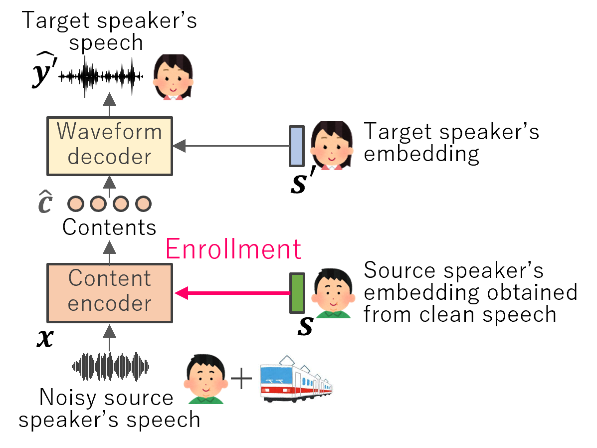

# SpeakerBeam-VC: Noise-Robust Voice Conversion with Speaker Enrollment — Demos   <!-- omit in toc -->
Authors: Hiroki Kanagawa, Yusuke Ijima, Kenichi Fujita, Takafumi Moriya, Taichi Asami  
Affiliation: NTT, Inc., Japan

# Comparison VCs

<table class="comp">
  <thead>
    <tr>
      <th>System</th>
      <th>Speech enhancement (SE) preprocessing before VC</th>
      <th>Use speaker Enrollment for content encoder</th>
      <th>Description</th>
    </tr>
  </thead>
  <tbody>
    <tr>
      <td>VanillaVC</td>
      <td>✘</td>
      <td>✘</td>
      <td>Standard VC without SE or enrollment.</td>
    </tr>
    <tr>
      <td>SE+VC</td>
      <td>✔︎</td>
      <td>✘</td>
      <td>VC with speech enhancement applied as preprocessing.</td>
    </tr>
    <tr class="ours">
      <td>SpkBeamVC (ours)</td>
      <td>✘</td>
      <td>✔︎</td>
      <td>Proposed SpeakerBeam-VC: Noise-robust VC with speaker enrollment.</td>
    </tr>
    <tr>
      <td>SE+SpkBeamVC</td>
      <td>✔︎</td>
      <td>✔︎</td>
      <td>Proposed variant: SE preprocessing combined with enrollment.</td>
    </tr>
  </tbody>
</table>

# Speech samples
- If you are having trouble listening to the audios, try refreshing the page.  
- All source and target speaker pairs are chosen from **unseen** test data.  
- Each audio sample is spoken in Japanese with the utterance “ずいぶんの情熱とエネルギーをもって勉強され研究された.”  
(in English as “It was studied and researched with considerable passion and energy.”)

## Female-to-Female

| Method | Mode | SNR=∞ | 20dB | 10dB | 5dB |
| :--- | :--- | :--- | :--- | :--- | :--- |
| Reference)  Noisy source speaker's speech | - | <button data-src="wav/src_noisy__F01@1__NR@NO_NOISE@infdB.wav" onclick="new Audio(this.dataset.src).play()">▶</button> | <button data-src="wav/src_noisy__F01@1__NR@SE_RESTAURANT@20dB.wav" onclick="new Audio(this.dataset.src).play()">▶</button> | <button data-src="wav/src_noisy__F01@1__NR@SE_RESTAURANT@10dB.wav" onclick="new Audio(this.dataset.src).play()">▶</button> | <button data-src="wav/src_noisy__F01@1__NR@SE_RESTAURANT@5dB.wav" onclick="new Audio(this.dataset.src).play()">▶</button> |
| Reference)  Source speaker's speech enhanced by SE | - | <button data-src="wav/src_enhanced__F01@1__NR@NO_NOISE@infdB.wav" onclick="new Audio(this.dataset.src).play()">▶</button> | <button data-src="wav/src_enhanced__F01@1__NR@SE_RESTAURANT@20dB.wav" onclick="new Audio(this.dataset.src).play()">▶</button> | <button data-src="wav/src_enhanced__F01@1__NR@SE_RESTAURANT@10dB.wav" onclick="new Audio(this.dataset.src).play()">▶</button> | <button data-src="wav/src_enhanced__F01@1__NR@SE_RESTAURANT@5dB.wav" onclick="new Audio(this.dataset.src).play()">▶</button> |
| Reference)  Target speaker's groud-truth clean speech | - | <button data-src="wav/tgt_gt__BAN@1.wav" onclick="new Audio(this.dataset.src).play()">▶</button> | | | |
| VanillaVC | Offline | <button data-src="wav/vanillavc.offline__female2female@1__NR@NO_NOISE@infdB.wav" onclick="new Audio(this.dataset.src).play()">▶</button> | <button data-src="wav/vanillavc.offline__female2female@1__NR@SE_RESTAURANT@20dB.wav" onclick="new Audio(this.dataset.src).play()">▶</button> | <button data-src="wav/vanillavc.offline__female2female@1__NR@SE_RESTAURANT@10dB.wav" onclick="new Audio(this.dataset.src).play()">▶</button> | <button data-src="wav/vanillavc.offline__female2female@1__NR@SE_RESTAURANT@5dB.wav" onclick="new Audio(this.dataset.src).play()">▶</button> |
| | Stream | <button data-src="wav/vanillavc.stream__female2female@1__NR@NO_NOISE@infdB.wav" onclick="new Audio(this.dataset.src).play()">▶</button> | <button data-src="wav/vanillavc.stream__female2female@1__NR@SE_RESTAURANT@20dB.wav" onclick="new Audio(this.dataset.src).play()">▶</button> | <button data-src="wav/vanillavc.stream__female2female@1__NR@SE_RESTAURANT@10dB.wav" onclick="new Audio(this.dataset.src).play()">▶</button> | <button data-src="wav/vanillavc.stream__female2female@1__NR@SE_RESTAURANT@5dB.wav" onclick="new Audio(this.dataset.src).play()">▶</button> |
| SE+VC | Offline | <button data-src="wav/se_vc.offline__female2female@1__NR@NO_NOISE@infdB.wav" onclick="new Audio(this.dataset.src).play()">▶</button> | <button data-src="wav/se_vc.offline__female2female@1__NR@SE_RESTAURANT@20dB.wav" onclick="new Audio(this.dataset.src).play()">▶</button> | <button data-src="wav/se_vc.offline__female2female@1__NR@SE_RESTAURANT@10dB.wav" onclick="new Audio(this.dataset.src).play()">▶</button> | <button data-src="wav/se_vc.offline__female2female@1__NR@SE_RESTAURANT@5dB.wav" onclick="new Audio(this.dataset.src).play()">▶</button> |
|  | Stream | <button data-src="wav/se_vc.stream__female2female@1__NR@NO_NOISE@infdB.wav" onclick="new Audio(this.dataset.src).play()">▶</button> | <button data-src="wav/se_vc.stream__female2female@1__NR@SE_RESTAURANT@20dB.wav" onclick="new Audio(this.dataset.src).play()">▶</button> | <button data-src="wav/se_vc.stream__female2female@1__NR@SE_RESTAURANT@10dB.wav" onclick="new Audio(this.dataset.src).play()">▶</button> | <button data-src="wav/se_vc.stream__female2female@1__NR@SE_RESTAURANT@5dB.wav" onclick="new Audio(this.dataset.src).play()">▶</button> |
| SpkBeamVC | Offline | <button data-src="wav/spkbeamvc.offline__female2female@1__NR@NO_NOISE@infdB.wav" onclick="new Audio(this.dataset.src).play()">▶</button> | <button data-src="wav/spkbeamvc.offline__female2female@1__NR@SE_RESTAURANT@20dB.wav" onclick="new Audio(this.dataset.src).play()">▶</button> | <button data-src="wav/spkbeamvc.offline__female2female@1__NR@SE_RESTAURANT@10dB.wav" onclick="new Audio(this.dataset.src).play()">▶</button> | <button data-src="wav/spkbeamvc.offline__female2female@1__NR@SE_RESTAURANT@5dB.wav" onclick="new Audio(this.dataset.src).play()">▶</button> |
|  | Stream | <button data-src="wav/spkbeamvc.stream__female2female@1__NR@NO_NOISE@infdB.wav" onclick="new Audio(this.dataset.src).play()">▶</button> | <button data-src="wav/spkbeamvc.stream__female2female@1__NR@SE_RESTAURANT@20dB.wav" onclick="new Audio(this.dataset.src).play()">▶</button> | <button data-src="wav/spkbeamvc.stream__female2female@1__NR@SE_RESTAURANT@10dB.wav" onclick="new Audio(this.dataset.src).play()">▶</button> | <button data-src="wav/spkbeamvc.stream__female2female@1__NR@SE_RESTAURANT@5dB.wav" onclick="new Audio(this.dataset.src).play()">▶</button> |
| SE+SpkBeamVC | Offline | <button data-src="wav/se_spkbeamvc.offline__female2female@1__NR@NO_NOISE@infdB.wav" onclick="new Audio(this.dataset.src).play()">▶</button> | <button data-src="wav/se_spkbeamvc.offline__female2female@1__NR@SE_RESTAURANT@20dB.wav" onclick="new Audio(this.dataset.src).play()">▶</button> | <button data-src="wav/se_spkbeamvc.offline__female2female@1__NR@SE_RESTAURANT@10dB.wav" onclick="new Audio(this.dataset.src).play()">▶</button> | <button data-src="wav/se_spkbeamvc.offline__female2female@1__NR@SE_RESTAURANT@5dB.wav" onclick="new Audio(this.dataset.src).play()">▶</button> |
|  | Stream | <button data-src="wav/se_spkbeamvc.stream__female2female@1__NR@NO_NOISE@infdB.wav" onclick="new Audio(this.dataset.src).play()">▶</button> | <button data-src="wav/se_spkbeamvc.stream__female2female@1__NR@SE_RESTAURANT@20dB.wav" onclick="new Audio(this.dataset.src).play()">▶</button> | <button data-src="wav/se_spkbeamvc.stream__female2female@1__NR@SE_RESTAURANT@10dB.wav" onclick="new Audio(this.dataset.src).play()">▶</button> | <button data-src="wav/se_spkbeamvc.stream__female2female@1__NR@SE_RESTAURANT@5dB.wav" onclick="new Audio(this.dataset.src).play()">▶</button> |
## Male-to-Female

| Method | Mode | SNR=∞ | 20dB | 10dB | 5dB |
| :--- | :--- | :--- | :--- | :--- | :--- |
| Reference)  Noisy source speaker's speech | - | <button data-src="wav/src_noisy__MIZUNO@1__NR@NO_NOISE@infdB.wav" onclick="new Audio(this.dataset.src).play()">▶</button> | <button data-src="wav/src_noisy__MIZUNO@1__NR@SE_RESTAURANT@20dB.wav" onclick="new Audio(this.dataset.src).play()">▶</button> | <button data-src="wav/src_noisy__MIZUNO@1__NR@SE_RESTAURANT@10dB.wav" onclick="new Audio(this.dataset.src).play()">▶</button> | <button data-src="wav/src_noisy__MIZUNO@1__NR@SE_RESTAURANT@5dB.wav" onclick="new Audio(this.dataset.src).play()">▶</button> |
| Reference)  Source speaker's speech enhanced by SE | - | <button data-src="wav/src_enhanced__MIZUNO@1__NR@NO_NOISE@infdB.wav" onclick="new Audio(this.dataset.src).play()">▶</button> | <button data-src="wav/src_enhanced__MIZUNO@1__NR@SE_RESTAURANT@20dB.wav" onclick="new Audio(this.dataset.src).play()">▶</button> | <button data-src="wav/src_enhanced__MIZUNO@1__NR@SE_RESTAURANT@10dB.wav" onclick="new Audio(this.dataset.src).play()">▶</button> | <button data-src="wav/src_enhanced__MIZUNO@1__NR@SE_RESTAURANT@5dB.wav" onclick="new Audio(this.dataset.src).play()">▶</button> |
| Reference)  Target speaker's groud-truth clean speech | - | <button data-src="wav/tgt_gt__BAN@1.wav" onclick="new Audio(this.dataset.src).play()">▶</button> | | | |
| VanillaVC | Offline | <button data-src="wav/vanillavc.offline__male2female@1__NR@NO_NOISE@infdB.wav" onclick="new Audio(this.dataset.src).play()">▶</button> | <button data-src="wav/vanillavc.offline__male2female@1__NR@SE_RESTAURANT@20dB.wav" onclick="new Audio(this.dataset.src).play()">▶</button> | <button data-src="wav/vanillavc.offline__male2female@1__NR@SE_RESTAURANT@10dB.wav" onclick="new Audio(this.dataset.src).play()">▶</button> | <button data-src="wav/vanillavc.offline__male2female@1__NR@SE_RESTAURANT@5dB.wav" onclick="new Audio(this.dataset.src).play()">▶</button> |
|  | Stream | <button data-src="wav/vanillavc.stream__male2female@1__NR@NO_NOISE@infdB.wav" onclick="new Audio(this.dataset.src).play()">▶</button> | <button data-src="wav/vanillavc.stream__male2female@1__NR@SE_RESTAURANT@20dB.wav" onclick="new Audio(this.dataset.src).play()">▶</button> | <button data-src="wav/vanillavc.stream__male2female@1__NR@SE_RESTAURANT@10dB.wav" onclick="new Audio(this.dataset.src).play()">▶</button> | <button data-src="wav/vanillavc.stream__male2female@1__NR@SE_RESTAURANT@5dB.wav" onclick="new Audio(this.dataset.src).play()">▶</button> |
| SE+VC | Offline | <button data-src="wav/se_vc.offline__male2female@1__NR@NO_NOISE@infdB.wav" onclick="new Audio(this.dataset.src).play()">▶</button> | <button data-src="wav/se_vc.offline__male2female@1__NR@SE_RESTAURANT@20dB.wav" onclick="new Audio(this.dataset.src).play()">▶</button> | <button data-src="wav/se_vc.offline__male2female@1__NR@SE_RESTAURANT@10dB.wav" onclick="new Audio(this.dataset.src).play()">▶</button> | <button data-src="wav/se_vc.offline__male2female@1__NR@SE_RESTAURANT@5dB.wav" onclick="new Audio(this.dataset.src).play()">▶</button> |
| | Stream | <button data-src="wav/se_vc.stream__male2female@1__NR@NO_NOISE@infdB.wav" onclick="new Audio(this.dataset.src).play()">▶</button> | <button data-src="wav/se_vc.stream__male2female@1__NR@SE_RESTAURANT@20dB.wav" onclick="new Audio(this.dataset.src).play()">▶</button> | <button data-src="wav/se_vc.stream__male2female@1__NR@SE_RESTAURANT@10dB.wav" onclick="new Audio(this.dataset.src).play()">▶</button> | <button data-src="wav/se_vc.stream__male2female@1__NR@SE_RESTAURANT@5dB.wav" onclick="new Audio(this.dataset.src).play()">▶</button> |
| SpkBeamVC | Offline | <button data-src="wav/spkbeamvc.offline__male2female@1__NR@NO_NOISE@infdB.wav" onclick="new Audio(this.dataset.src).play()">▶</button> | <button data-src="wav/spkbeamvc.offline__male2female@1__NR@SE_RESTAURANT@20dB.wav" onclick="new Audio(this.dataset.src).play()">▶</button> | <button data-src="wav/spkbeamvc.offline__male2female@1__NR@SE_RESTAURANT@10dB.wav" onclick="new Audio(this.dataset.src).play()">▶</button> | <button data-src="wav/spkbeamvc.offline__male2female@1__NR@SE_RESTAURANT@5dB.wav" onclick="new Audio(this.dataset.src).play()">▶</button> |
| | Stream | <button data-src="wav/spkbeamvc.stream__male2female@1__NR@NO_NOISE@infdB.wav" onclick="new Audio(this.dataset.src).play()">▶</button> | <button data-src="wav/spkbeamvc.stream__male2female@1__NR@SE_RESTAURANT@20dB.wav" onclick="new Audio(this.dataset.src).play()">▶</button> | <button data-src="wav/spkbeamvc.stream__male2female@1__NR@SE_RESTAURANT@10dB.wav" onclick="new Audio(this.dataset.src).play()">▶</button> | <button data-src="wav/spkbeamvc.stream__male2female@1__NR@SE_RESTAURANT@5dB.wav" onclick="new Audio(this.dataset.src).play()">▶</button> |
| SE+SpkBeamVC | Offline | <button data-src="wav/se_spkbeamvc.offline__male2female@1__NR@NO_NOISE@infdB.wav" onclick="new Audio(this.dataset.src).play()">▶</button> | <button data-src="wav/se_spkbeamvc.offline__male2female@1__NR@SE_RESTAURANT@20dB.wav" onclick="new Audio(this.dataset.src).play()">▶</button> | <button data-src="wav/se_spkbeamvc.offline__male2female@1__NR@SE_RESTAURANT@10dB.wav" onclick="new Audio(this.dataset.src).play()">▶</button> | <button data-src="wav/se_spkbeamvc.offline__male2female@1__NR@SE_RESTAURANT@5dB.wav" onclick="new Audio(this.dataset.src).play()">▶</button> |
|  | Stream | <button data-src="wav/se_spkbeamvc.stream__male2female@1__NR@NO_NOISE@infdB.wav" onclick="new Audio(this.dataset.src).play()">▶</button> | <button data-src="wav/se_spkbeamvc.stream__male2female@1__NR@SE_RESTAURANT@20dB.wav" onclick="new Audio(this.dataset.src).play()">▶</button> | <button data-src="wav/se_spkbeamvc.stream__male2female@1__NR@SE_RESTAURANT@10dB.wav" onclick="new Audio(this.dataset.src).play()">▶</button> | <button data-src="wav/se_spkbeamvc.stream__male2female@1__NR@SE_RESTAURANT@5dB.wav" onclick="new Audio(this.dataset.src).play()">▶</button> |
## Male-to-Male

| Method | Mode | SNR=∞ | 20dB | 10dB | 5dB |
| :--- | :--- | :--- | :--- | :--- | :--- |
| Reference)  Noisy source speaker's speech | - | <button data-src="wav/src_noisy__MIZUNO@1__NR@NO_NOISE@infdB.wav" onclick="new Audio(this.dataset.src).play()">▶</button> | <button data-src="wav/src_noisy__MIZUNO@1__NR@SE_RESTAURANT@20dB.wav" onclick="new Audio(this.dataset.src).play()">▶</button> | <button data-src="wav/src_noisy__MIZUNO@1__NR@SE_RESTAURANT@10dB.wav" onclick="new Audio(this.dataset.src).play()">▶</button> | <button data-src="wav/src_noisy__MIZUNO@1__NR@SE_RESTAURANT@5dB.wav" onclick="new Audio(this.dataset.src).play()">▶</button> |
| Reference)  Source speaker's speech enhanced by SE | - | <button data-src="wav/src_enhanced__MIZUNO@1__NR@NO_NOISE@infdB.wav" onclick="new Audio(this.dataset.src).play()">▶</button> | <button data-src="wav/src_enhanced__MIZUNO@1__NR@SE_RESTAURANT@20dB.wav" onclick="new Audio(this.dataset.src).play()">▶</button> | <button data-src="wav/src_enhanced__MIZUNO@1__NR@SE_RESTAURANT@10dB.wav" onclick="new Audio(this.dataset.src).play()">▶</button> | <button data-src="wav/src_enhanced__MIZUNO@1__NR@SE_RESTAURANT@5dB.wav" onclick="new Audio(this.dataset.src).play()">▶</button> |
| Reference)  Target speaker's groud-truth clean speech | - | <button data-src="wav/tgt_gt__M01@1.wav" onclick="new Audio(this.dataset.src).play()">▶</button> | | | |
| VanillaVC | Offline | <button data-src="wav/vanillavc.offline__male2male@1__NR@NO_NOISE@infdB.wav" onclick="new Audio(this.dataset.src).play()">▶</button> | <button data-src="wav/vanillavc.offline__male2male@1__NR@SE_RESTAURANT@20dB.wav" onclick="new Audio(this.dataset.src).play()">▶</button> | <button data-src="wav/vanillavc.offline__male2male@1__NR@SE_RESTAURANT@10dB.wav" onclick="new Audio(this.dataset.src).play()">▶</button> | <button data-src="wav/vanillavc.offline__male2male@1__NR@SE_RESTAURANT@5dB.wav" onclick="new Audio(this.dataset.src).play()">▶</button> |
|  | Stream | <button data-src="wav/vanillavc.stream__male2male@1__NR@NO_NOISE@infdB.wav" onclick="new Audio(this.dataset.src).play()">▶</button> | <button data-src="wav/vanillavc.stream__male2male@1__NR@SE_RESTAURANT@20dB.wav" onclick="new Audio(this.dataset.src).play()">▶</button> | <button data-src="wav/vanillavc.stream__male2male@1__NR@SE_RESTAURANT@10dB.wav" onclick="new Audio(this.dataset.src).play()">▶</button> | <button data-src="wav/vanillavc.stream__male2male@1__NR@SE_RESTAURANT@5dB.wav" onclick="new Audio(this.dataset.src).play()">▶</button> |
| SE+VC | Offline | <button data-src="wav/se_vc.offline__male2male@1__NR@NO_NOISE@infdB.wav" onclick="new Audio(this.dataset.src).play()">▶</button> | <button data-src="wav/se_vc.offline__male2male@1__NR@SE_RESTAURANT@20dB.wav" onclick="new Audio(this.dataset.src).play()">▶</button> | <button data-src="wav/se_vc.offline__male2male@1__NR@SE_RESTAURANT@10dB.wav" onclick="new Audio(this.dataset.src).play()">▶</button> | <button data-src="wav/se_vc.offline__male2male@1__NR@SE_RESTAURANT@5dB.wav" onclick="new Audio(this.dataset.src).play()">▶</button> |
|  | Stream | <button data-src="wav/se_vc.stream__male2male@1__NR@NO_NOISE@infdB.wav" onclick="new Audio(this.dataset.src).play()">▶</button> | <button data-src="wav/se_vc.stream__male2male@1__NR@SE_RESTAURANT@20dB.wav" onclick="new Audio(this.dataset.src).play()">▶</button> | <button data-src="wav/se_vc.stream__male2male@1__NR@SE_RESTAURANT@10dB.wav" onclick="new Audio(this.dataset.src).play()">▶</button> | <button data-src="wav/se_vc.stream__male2male@1__NR@SE_RESTAURANT@5dB.wav" onclick="new Audio(this.dataset.src).play()">▶</button> |
| SpkBeamVC | Offline | <button data-src="wav/spkbeamvc.offline__male2male@1__NR@NO_NOISE@infdB.wav" onclick="new Audio(this.dataset.src).play()">▶</button> | <button data-src="wav/spkbeamvc.offline__male2male@1__NR@SE_RESTAURANT@20dB.wav" onclick="new Audio(this.dataset.src).play()">▶</button> | <button data-src="wav/spkbeamvc.offline__male2male@1__NR@SE_RESTAURANT@10dB.wav" onclick="new Audio(this.dataset.src).play()">▶</button> | <button data-src="wav/spkbeamvc.offline__male2male@1__NR@SE_RESTAURANT@5dB.wav" onclick="new Audio(this.dataset.src).play()">▶</button> |
|  | Stream | <button data-src="wav/spkbeamvc.stream__male2male@1__NR@NO_NOISE@infdB.wav" onclick="new Audio(this.dataset.src).play()">▶</button> | <button data-src="wav/spkbeamvc.stream__male2male@1__NR@SE_RESTAURANT@20dB.wav" onclick="new Audio(this.dataset.src).play()">▶</button> | <button data-src="wav/spkbeamvc.stream__male2male@1__NR@SE_RESTAURANT@10dB.wav" onclick="new Audio(this.dataset.src).play()">▶</button> | <button data-src="wav/spkbeamvc.stream__male2male@1__NR@SE_RESTAURANT@5dB.wav" onclick="new Audio(this.dataset.src).play()">▶</button> |
| SE+SpkBeamVC | Offline | <button data-src="wav/se_spkbeamvc.offline__male2male@1__NR@NO_NOISE@infdB.wav" onclick="new Audio(this.dataset.src).play()">▶</button> | <button data-src="wav/se_spkbeamvc.offline__male2male@1__NR@SE_RESTAURANT@20dB.wav" onclick="new Audio(this.dataset.src).play()">▶</button> | <button data-src="wav/se_spkbeamvc.offline__male2male@1__NR@SE_RESTAURANT@10dB.wav" onclick="new Audio(this.dataset.src).play()">▶</button> | <button data-src="wav/se_spkbeamvc.offline__male2male@1__NR@SE_RESTAURANT@5dB.wav" onclick="new Audio(this.dataset.src).play()">▶</button> |
|  | Stream | <button data-src="wav/se_spkbeamvc.stream__male2male@1__NR@NO_NOISE@infdB.wav" onclick="new Audio(this.dataset.src).play()">▶</button> | <button data-src="wav/se_spkbeamvc.stream__male2male@1__NR@SE_RESTAURANT@20dB.wav" onclick="new Audio(this.dataset.src).play()">▶</button> | <button data-src="wav/se_spkbeamvc.stream__male2male@1__NR@SE_RESTAURANT@10dB.wav" onclick="new Audio(this.dataset.src).play()">▶</button> | <button data-src="wav/se_spkbeamvc.stream__male2male@1__NR@SE_RESTAURANT@5dB.wav" onclick="new Audio(this.dataset.src).play()">▶</button> |
## Female-to-Male

| Method | Mode | SNR=∞ | 20dB | 10dB | 5dB |
| :--- | :--- | :--- | :--- | :--- | :--- |
| Reference)  Noisy source speaker's speech | - | <button data-src="wav/src_noisy__F01@1__NR@NO_NOISE@infdB.wav" onclick="new Audio(this.dataset.src).play()">▶</button> | <button data-src="wav/src_noisy__F01@1__NR@SE_RESTAURANT@20dB.wav" onclick="new Audio(this.dataset.src).play()">▶</button> | <button data-src="wav/src_noisy__F01@1__NR@SE_RESTAURANT@10dB.wav" onclick="new Audio(this.dataset.src).play()">▶</button> | <button data-src="wav/src_noisy__F01@1__NR@SE_RESTAURANT@5dB.wav" onclick="new Audio(this.dataset.src).play()">▶</button> |
| Reference)  Source speaker's speech enhanced by SE | - | <button data-src="wav/src_enhanced__F01@1__NR@NO_NOISE@infdB.wav" onclick="new Audio(this.dataset.src).play()">▶</button> | <button data-src="wav/src_enhanced__F01@1__NR@SE_RESTAURANT@20dB.wav" onclick="new Audio(this.dataset.src).play()">▶</button> | <button data-src="wav/src_enhanced__F01@1__NR@SE_RESTAURANT@10dB.wav" onclick="new Audio(this.dataset.src).play()">▶</button> | <button data-src="wav/src_enhanced__F01@1__NR@SE_RESTAURANT@5dB.wav" onclick="new Audio(this.dataset.src).play()">▶</button> |
| Reference)  Target speaker's groud-truth clean speech | - | <button data-src="wav/tgt_gt__M01@1.wav" onclick="new Audio(this.dataset.src).play()">▶</button> | | | |
| VanillaVC | Offline | <button data-src="wav/vanillavc.offline__female2male@1__NR@NO_NOISE@infdB.wav" onclick="new Audio(this.dataset.src).play()">▶</button> | <button data-src="wav/vanillavc.offline__female2male@1__NR@SE_RESTAURANT@20dB.wav" onclick="new Audio(this.dataset.src).play()">▶</button> | <button data-src="wav/vanillavc.offline__female2male@1__NR@SE_RESTAURANT@10dB.wav" onclick="new Audio(this.dataset.src).play()">▶</button> | <button data-src="wav/vanillavc.offline__female2male@1__NR@SE_RESTAURANT@5dB.wav" onclick="new Audio(this.dataset.src).play()">▶</button> |
|  | Stream | <button data-src="wav/vanillavc.stream__female2male@1__NR@NO_NOISE@infdB.wav" onclick="new Audio(this.dataset.src).play()">▶</button> | <button data-src="wav/vanillavc.stream__female2male@1__NR@SE_RESTAURANT@20dB.wav" onclick="new Audio(this.dataset.src).play()">▶</button> | <button data-src="wav/vanillavc.stream__female2male@1__NR@SE_RESTAURANT@10dB.wav" onclick="new Audio(this.dataset.src).play()">▶</button> | <button data-src="wav/vanillavc.stream__female2male@1__NR@SE_RESTAURANT@5dB.wav" onclick="new Audio(this.dataset.src).play()">▶</button> |
| SE+VC | Offline | <button data-src="wav/se_vc.offline__female2male@1__NR@NO_NOISE@infdB.wav" onclick="new Audio(this.dataset.src).play()">▶</button> | <button data-src="wav/se_vc.offline__female2male@1__NR@SE_RESTAURANT@20dB.wav" onclick="new Audio(this.dataset.src).play()">▶</button> | <button data-src="wav/se_vc.offline__female2male@1__NR@SE_RESTAURANT@10dB.wav" onclick="new Audio(this.dataset.src).play()">▶</button> | <button data-src="wav/se_vc.offline__female2male@1__NR@SE_RESTAURANT@5dB.wav" onclick="new Audio(this.dataset.src).play()">▶</button> |
| | Stream | <button data-src="wav/se_vc.stream__female2male@1__NR@NO_NOISE@infdB.wav" onclick="new Audio(this.dataset.src).play()">▶</button> | <button data-src="wav/se_vc.stream__female2male@1__NR@SE_RESTAURANT@20dB.wav" onclick="new Audio(this.dataset.src).play()">▶</button> | <button data-src="wav/se_vc.stream__female2male@1__NR@SE_RESTAURANT@10dB.wav" onclick="new Audio(this.dataset.src).play()">▶</button> | <button data-src="wav/se_vc.stream__female2male@1__NR@SE_RESTAURANT@5dB.wav" onclick="new Audio(this.dataset.src).play()">▶</button> |
| SpkBeamVC | Offline | <button data-src="wav/spkbeamvc.offline__female2male@1__NR@NO_NOISE@infdB.wav" onclick="new Audio(this.dataset.src).play()">▶</button> | <button data-src="wav/spkbeamvc.offline__female2male@1__NR@SE_RESTAURANT@20dB.wav" onclick="new Audio(this.dataset.src).play()">▶</button> | <button data-src="wav/spkbeamvc.offline__female2male@1__NR@SE_RESTAURANT@10dB.wav" onclick="new Audio(this.dataset.src).play()">▶</button> | <button data-src="wav/spkbeamvc.offline__female2male@1__NR@SE_RESTAURANT@5dB.wav" onclick="new Audio(this.dataset.src).play()">▶</button> |
|  | Stream | <button data-src="wav/spkbeamvc.stream__female2male@1__NR@NO_NOISE@infdB.wav" onclick="new Audio(this.dataset.src).play()">▶</button> | <button data-src="wav/spkbeamvc.stream__female2male@1__NR@SE_RESTAURANT@20dB.wav" onclick="new Audio(this.dataset.src).play()">▶</button> | <button data-src="wav/spkbeamvc.stream__female2male@1__NR@SE_RESTAURANT@10dB.wav" onclick="new Audio(this.dataset.src).play()">▶</button> | <button data-src="wav/spkbeamvc.stream__female2male@1__NR@SE_RESTAURANT@5dB.wav" onclick="new Audio(this.dataset.src).play()">▶</button> |
| SE+SpkBeamVC | Offline | <button data-src="wav/se_spkbeamvc.offline__female2male@1__NR@NO_NOISE@infdB.wav" onclick="new Audio(this.dataset.src).play()">▶</button> | <button data-src="wav/se_spkbeamvc.offline__female2male@1__NR@SE_RESTAURANT@20dB.wav" onclick="new Audio(this.dataset.src).play()">▶</button> | <button data-src="wav/se_spkbeamvc.offline__female2male@1__NR@SE_RESTAURANT@10dB.wav" onclick="new Audio(this.dataset.src).play()">▶</button> | <button data-src="wav/se_spkbeamvc.offline__female2male@1__NR@SE_RESTAURANT@5dB.wav" onclick="new Audio(this.dataset.src).play()">▶</button> |
|  | Stream | <button data-src="wav/se_spkbeamvc.stream__female2male@1__NR@NO_NOISE@infdB.wav" onclick="new Audio(this.dataset.src).play()">▶</button> | <button data-src="wav/se_spkbeamvc.stream__female2male@1__NR@SE_RESTAURANT@20dB.wav" onclick="new Audio(this.dataset.src).play()">▶</button> | <button data-src="wav/se_spkbeamvc.stream__female2male@1__NR@SE_RESTAURANT@10dB.wav" onclick="new Audio(this.dataset.src).play()">▶</button> | <button data-src="wav/se_spkbeamvc.stream__female2male@1__NR@SE_RESTAURANT@5dB.wav" onclick="new Audio(this.dataset.src).play()">▶</button> |
